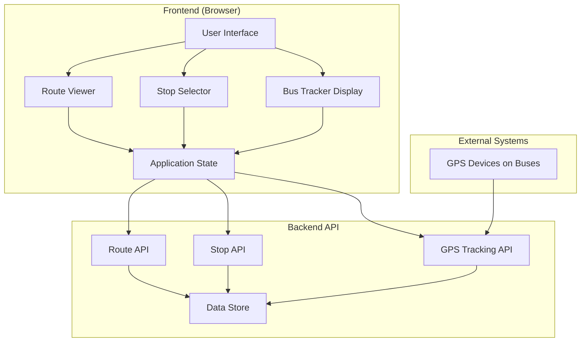

# Design Document: Bus Tracking System

## Overview

The Bus Tracking System is a web-based passenger-facing application that provides real-time bus tracking and route information. The system architecture follows a client-server model with a frontend interface for passengers and a backend API for data management and GPS tracking integration.

The core functionality includes:
- Displaying available bus routes with complete stop sequences
- Allowing passengers to select their desired drop-off stop
- Showing real-time GPS locations of active buses
- Tracking stop-by-stop progress as buses move along routes

The system emphasizes real-time data updates, user-friendly interfaces, and accurate GPS tracking to provide passengers with reliable transit information.

## Architecture

### System Components



### Architecture Layers

1. **Presentation Layer (Frontend)**
   - HTML/CSS/JavaScript interface
   - Responsive design for various devices
   - Real-time UI updates via polling or WebSocket connections
   - Client-side state management

2. **API Layer (Backend)**
   - RESTful API endpoints for routes, stops, and GPS data
   - Request validation and error handling
   - Data transformation and formatting
   - Real-time GPS data aggregation

3. **Data Layer**
   - Persistent storage for routes and stops
   - Temporary storage for GPS location data
   - Data validation and integrity checks

4. **Integration Layer**
   - GPS device integration
   - Location data processing
   - Coordinate validation and normalization

## Components and Interfaces

### Frontend Components

#### 1. Route Viewer Component

**Responsibility**: Display available routes and their stop sequences

**Interface**:
```typescript
interface RouteViewer {
  // Display all available routes
  displayRoutes(routes: Route[]): void
  
  // Display stops for a selected route
  displayRouteStops(routeId: string, stops: Stop[]): void
  
  // Handle route selection
  onRouteSelected(routeId: string): void
}

interface Route {
  id: string
  name: string
  stopIds: string[]  // Ordered list of stop IDs
}
```

#### 2. Stop Selector Component

**Responsibility**: Allow passengers to select their drop-off stop

**Interface**:
```typescript
interface StopSelector {
  // Display selectable stops
  displayStops(stops: Stop[]): void
  
  // Handle stop selection
  onStopSelected(stopId: string): void
  
  // Get currently selected stop
  getSelectedStop(): string | null
  
  // Clear selection
  clearSelection(): void
}

interface Stop {
  id: string
  name: string
  latitude: number
  longitude: number
  sequenceNumber: number
}
```

#### 3. Bus Tracker Display Component

**Responsibility**: Show real-time bus locations and progress

**Interface**:
```typescript
interface BusTrackerDisplay {
  // Update bus location on route
  updateBusLocation(busId: string, location: GPSCoordinate): void
  
  // Display multiple buses on same route
  displayBuses(buses: BusLocation[]): void
  
  // Update stop completion status
  updateStopStatus(stopId: string, status: StopStatus): void
  
  // Handle GPS unavailable state
  showGPSUnavailable(busId: string): void
}

interface BusLocation {
  busId: string
  routeId: string
  currentLocation: GPSCoordinate
  lastUpdated: Date
}

interface GPSCoordinate {
  latitude: number
  longitude: number
}

enum StopStatus {
  COMPLETED = "completed",
  CURRENT = "current",
  UPCOMING = "upcoming"
}
```

#### 4. Application State Manager

**Responsibility**: Manage application state and coordinate between components

**Interface**:
```typescript
interface StateManager {
  // Route state
  loadRoutes(): Promise<Route[]>
  selectRoute(routeId: string): Promise<void>
  getCurrentRoute(): Route | null
  
  // Stop state
  loadStopsForRoute(routeId: string): Promise<Stop[]>
  selectDropOffStop(stopId: string): void
  getSelectedDropOffStop(): string | null
  
  // Bus tracking state
  startTrackingBuses(routeId: string): void
  stopTrackingBuses(): void
  getBusLocations(): BusLocation[]
  
  // Update polling
  startPolling(intervalMs: number): void
  stopPolling(): void
}
```

### Backend API Endpoints

#### Route API

```
GET /api/routes
Response: Array<Route>
Description: Retrieve all available routes

GET /api/routes/:routeId
Response: Route with embedded stops
Description: Retrieve a specific route with all stops in sequence

GET /api/routes/:routeId/stops
Response: Array<Stop>
Description: Retrieve all stops for a specific route in order
```

#### Stop API

```
GET /api/stops/:stopId
Response: Stop
Description: Retrieve details for a specific stop

GET /api/stops
Query params: ?ids=stop1,stop2,stop3
Response: Array<Stop>
Description: Retrieve multiple stops by IDs
```

#### GPS Tracking API

```
GET /api/buses/locations
Query params: ?routeId=route1
Response: Array<BusLocation>
Description: Retrieve current GPS locations for all buses on a route

GET /api/buses/:busId/location
Response: BusLocation
Description: Retrieve current GPS location for a specific bus

POST /api/buses/:busId/location
Body: { latitude: number, longitude: number, timestamp: string }
Response: Success confirmation
Description: Update GPS location for a bus (called by GPS devices)
```

## Data Models

### Route Model

```typescript
interface Route {
  id: string              // Unique identifier (e.g., "route-101")
  name: string            // Display name (e.g., "Downtown Express")
  stopIds: string[]       // Ordered array of stop IDs
  isActive: boolean       // Whether route is currently in service
  createdAt: Date
  updatedAt: Date
}
```

**Storage**: Persistent database (SQL or NoSQL)

**Validation Rules**:
- `id` must be unique and non-empty
- `name` must be non-empty
- `stopIds` must contain at least 2 stops
- `stopIds` must reference valid stops in the system

### Stop Model

```typescript
interface Stop {
  id: string              // Unique identifier (e.g., "stop-501")
  name: string            // Display name (e.g., "Main St & 5th Ave")
  latitude: number        // GPS latitude (-90 to 90)
  longitude: number       // GPS longitude (-180 to 180)
  address: string         // Human-readable address
  createdAt: Date
  updatedAt: Date
}
```

**Storage**: Persistent database

**Validation Rules**:
- `id` must be unique and non-empty
- `name` must be non-empty
- `latitude` must be between -90 and 90
- `longitude` must be between -180 and 180

### Bus Location Model

```typescript
interface BusLocation {
  busId: string           // Unique bus identifier
  routeId: string         // Current route being served
  latitude: number        // Current GPS latitude
  longitude: number       // Current GPS longitude
  timestamp: Date         // When location was recorded
  speed: number           // Speed in km/h (optional)
  heading: number         // Direction in degrees (optional)
}
```

**Storage**: In-memory cache or time-series database (short retention)

**Validation Rules**:
- `busId` must be non-empty
- `routeId` must reference a valid route
- `latitude` must be between -90 and 90
- `longitude` must be between -180 and 180
- `timestamp` must not be in the future
- `timestamp` should be recent (within last 5 minutes for "real-time")

### Stop Progress Model

```typescript
interface StopProgress {
  busId: string
  routeId: string
  stopId: string
  status: StopStatus      // "completed" | "current" | "upcoming"
  arrivalTime: Date | null
  departureTime: Date | null
}
```

**Storage**: In-memory cache (derived from bus location)

**Calculation Logic**:
- Stop is "completed" if bus has passed it (based on sequence and proximity)
- Stop is "current" if bus is within proximity threshold (e.g., 100 meters)
- Stop is "upcoming" if bus hasn't reached it yet

### Proximity Calculation

To determine if a bus has reached a stop, use the Haversine formula:

```typescript
function calculateDistance(
  lat1: number, lon1: number,
  lat2: number, lon2: number
): number {
  const R = 6371e3; // Earth radius in meters
  const φ1 = lat1 * Math.PI / 180;
  const φ2 = lat2 * Math.PI / 180;
  const Δφ = (lat2 - lat1) * Math.PI / 180;
  const Δλ = (lon2 - lon1) * Math.PI / 180;

  const a = Math.sin(Δφ/2) * Math.sin(Δφ/2) +
            Math.cos(φ1) * Math.cos(φ2) *
            Math.sin(Δλ/2) * Math.sin(Δλ/2);
  const c = 2 * Math.atan2(Math.sqrt(a), Math.sqrt(1-a));

  return R * c; // Distance in meters
}

const STOP_PROXIMITY_THRESHOLD = 100; // meters

function isAtStop(busLocation: GPSCoordinate, stop: Stop): boolean {
  const distance = calculateDistance(
    busLocation.latitude, busLocation.longitude,
    stop.latitude, stop.longitude
  );
  return distance <= STOP_PROXIMITY_THRESHOLD;
}
```


## Correctness Properties

*A property is a characteristic or behavior that should hold true across all valid executions of a system—essentially, a formal statement about what the system should do. Properties serve as the bridge between human-readable specifications and machine-verifiable correctness guarantees.*

### Property 1: Route Display Completeness

*For any* route, when displayed, the rendered output must contain both the route identifier and the route name.

**Validates: Requirements 1.2**

### Property 2: Stop Sequence Completeness and Order

*For any* route with N stops, when a passenger selects that route, the system must display all N stops in their defined sequential order.

**Validates: Requirements 1.3, 1.4, 4.4, 5.4**

### Property 3: All Stops Selectable

*For any* route being viewed, all stops on that route must be displayed as selectable options in the stop selector.

**Validates: Requirements 2.1**

### Property 4: Stop Selection Registration

*For any* stop, when a passenger clicks on it, the system must mark that stop as the currently selected drop-off location.

**Validates: Requirements 2.2**

### Property 5: Single Selection Invariant

*For any* sequence of stop selections, the system must maintain at most one selected drop-off stop at any given time.

**Validates: Requirements 2.4, 2.5**

### Property 6: GPS Retrieval for Active Buses

*For any* route with active buses, when a passenger views that route, the system must retrieve current GPS coordinates for each bus on that route.

**Validates: Requirements 3.1**

### Property 7: Multiple Bus Display

*For any* route with N active buses, the system must display location information for all N buses.

**Validates: Requirements 3.5**

### Property 8: Stop Status Assignment

*For any* bus being tracked on a route with N stops, the system must assign a completion status (completed, current, or upcoming) to all N stops.

**Validates: Requirements 4.1**

### Property 9: Stop Completion on Passage

*For any* bus and stop, when the bus's GPS location moves past that stop's location (based on sequence and proximity), the system must mark that stop as completed.

**Validates: Requirements 4.2**

### Property 10: Status Update on Location Change

*For any* bus location update, the system must recalculate and update the completion status for all stops on that bus's route.

**Validates: Requirements 4.5**

### Property 11: Route Data Persistence Round-Trip

*For any* valid route object (with identifier, name, and ordered stop IDs), storing the route and then retrieving it must produce an equivalent route object with all fields preserved.

**Validates: Requirements 5.1, 5.3**

### Property 12: Stop Data Persistence Round-Trip

*For any* valid stop object (with identifier, name, and GPS coordinates), storing the stop and then retrieving it must produce an equivalent stop object with all fields preserved.

**Validates: Requirements 5.2, 5.5**

### Property 13: View Context Preservation

*For any* UI state (selected route, selected stop, scroll position), when the display is updated with new data, the passenger's current view context must remain unchanged unless explicitly modified by the passenger.

**Validates: Requirements 6.3**

### Property 14: GPS Coordinate Validation

*For any* GPS coordinate input, the system must accept coordinates where latitude is between -90 and 90 and longitude is between -180 and 180, and must reject coordinates outside these ranges.

**Validates: Requirements 7.1**

### Property 15: Proximity-Based Stop Detection

*For any* bus location and stop location, when the distance between them is less than or equal to the proximity threshold (100 meters), the system must consider the bus as being at that stop.

**Validates: Requirements 7.3**

### Property 16: GPS Timestamp Recording

*For any* GPS location update, the system must record a timestamp indicating when the location was captured.

**Validates: Requirements 7.5**

## Error Handling

### GPS Data Errors

**Missing GPS Data**:
- When GPS data is unavailable for a bus, display "Location unavailable" message
- Continue showing last known location with timestamp
- Retry GPS data fetch on next polling interval

**Invalid GPS Coordinates**:
- Reject coordinates outside valid ranges (lat: -90 to 90, lon: -180 to 180)
- Log validation errors for monitoring
- Do not update bus location display with invalid data

**Stale GPS Data**:
- Mark location as stale if timestamp is older than 5 minutes
- Display warning indicator to passengers
- Continue attempting to fetch fresh data

**Off-Route Detection**:
- If bus location is more than 500 meters from any point on the route, flag as potentially inaccurate
- Display warning but still show location
- Log anomaly for investigation

### API Errors

**Network Failures**:
- Display user-friendly error message: "Unable to connect. Please check your internet connection."
- Retry failed requests with exponential backoff (1s, 2s, 4s, 8s)
- Cache last successful data and display with "Last updated" timestamp

**Server Errors (5xx)**:
- Display: "Service temporarily unavailable. Please try again in a moment."
- Retry after 5 seconds
- Log error details for debugging

**Not Found Errors (404)**:
- For missing routes: "Route not found. Please select a different route."
- For missing stops: "Stop information unavailable."
- Do not retry (permanent error)

**Validation Errors (400)**:
- Display specific validation message from server
- Do not retry without user correction
- Log validation failures

### Data Consistency Errors

**Route with Missing Stops**:
- If a route references stop IDs that don't exist, filter out missing stops
- Display warning: "Some stop information is unavailable"
- Log data inconsistency for correction

**Empty Routes**:
- If a route has no stops, do not display it in the route list
- Log error for data correction

**Duplicate Selections**:
- If system state becomes inconsistent with multiple selections, keep most recent selection
- Clear all other selections
- Log state inconsistency

## Testing Strategy

### Dual Testing Approach

The Bus Tracking System will employ both unit testing and property-based testing to ensure comprehensive coverage:

**Unit Tests**: Focus on specific examples, edge cases, and error conditions
- Test specific route/stop configurations
- Test error handling scenarios (missing GPS, invalid coordinates)
- Test integration points between components
- Test UI state transitions with concrete examples

**Property-Based Tests**: Verify universal properties across all inputs
- Generate random routes, stops, and GPS coordinates
- Verify properties hold for all generated inputs
- Run minimum 100 iterations per property test
- Catch edge cases that manual test cases might miss

Together, these approaches provide comprehensive coverage where unit tests catch concrete bugs and property tests verify general correctness.

### Property-Based Testing Configuration

**Testing Library**: Use **fast-check** for JavaScript/TypeScript property-based testing

**Configuration**:
- Minimum 100 iterations per property test (due to randomization)
- Each property test must reference its design document property
- Tag format: `// Feature: bus-tracking-system, Property {number}: {property_text}`

**Example Property Test Structure**:
```typescript
import fc from 'fast-check';

// Feature: bus-tracking-system, Property 2: Stop Sequence Completeness and Order
test('route displays all stops in sequential order', () => {
  fc.assert(
    fc.property(
      fc.record({
        id: fc.string(),
        name: fc.string(),
        stopIds: fc.array(fc.string(), { minLength: 2 })
      }),
      (route) => {
        const displayedStops = displayRouteStops(route);
        expect(displayedStops.length).toBe(route.stopIds.length);
        expect(displayedStops.map(s => s.id)).toEqual(route.stopIds);
      }
    ),
    { numRuns: 100 }
  );
});
```

### Test Coverage Areas

**Route Management**:
- Unit tests: Test loading routes, selecting specific routes, empty route lists
- Property tests: Properties 1, 2, 11 (route display and persistence)

**Stop Selection**:
- Unit tests: Test selecting first stop, last stop, deselecting
- Property tests: Properties 3, 4, 5 (stop display and selection invariants)

**GPS Tracking**:
- Unit tests: Test GPS unavailable, stale data, single bus tracking
- Property tests: Properties 6, 7, 14, 16 (GPS retrieval and validation)

**Stop Progress**:
- Unit tests: Test bus at first stop, bus at last stop, bus between stops
- Property tests: Properties 8, 9, 10, 15 (status calculation and updates)

**Data Persistence**:
- Unit tests: Test saving/loading specific routes and stops
- Property tests: Properties 11, 12 (round-trip persistence)

**UI State Management**:
- Unit tests: Test specific state transitions
- Property tests: Property 13 (view context preservation)

### Integration Testing

**End-to-End Scenarios**:
1. Passenger selects route → views stops → selects drop-off → tracks bus
2. Multiple buses on same route with different progress
3. GPS data updates while passenger is viewing route
4. Network failure and recovery during tracking

**Performance Testing**:
- Response time under 500ms for user interactions (Requirement 6.1)
- GPS updates reflected within 10 seconds (Requirement 3.3)
- Load testing with multiple simultaneous passengers

### Edge Cases and Error Conditions

**Edge Cases to Test**:
- Route with minimum stops (2 stops)
- Route with maximum stops (e.g., 50+ stops)
- Bus exactly at stop boundary (proximity threshold)
- Bus at first stop, bus at last stop
- Empty route list
- No active buses on route
- Multiple buses at same location
- GPS coordinates at extreme valid values (±90 lat, ±180 lon)
- GPS coordinates at equator (0, 0)
- Rapid consecutive stop selections

**Error Conditions to Test**:
- Invalid GPS coordinates (out of range)
- Missing GPS data
- Stale GPS data (old timestamp)
- Off-route GPS location
- Network timeout
- Server error responses
- Missing route data
- Missing stop data
- Malformed API responses
